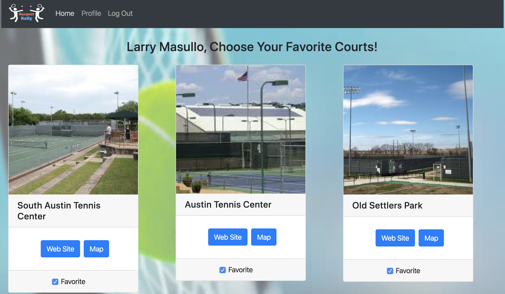

# Project Title

**Racquet Rally - A React App for Tennis Players**

## Description:

Racquet Rally allows you to connect with other tennis players of your skill level at the Austin area tennis centers.

## Installing:

- Clone this repo
- Run npm install
- Run npm start
- Your node server will be on localhost:4000
- The React App will run on localhost:3000

## Built With:

Backend:

- Node
- Express
- MongoDB
- Mongoose
- Dotenv
- Oauth2.0
- Passport

Frontend:

- React
- React bootsrap
- JSX
- Axios
- Reactjs-videobg

## Instructions:

- Log in using Google and your account will be created
- The Home Page displays the tennis centers. You can click on each center for more details and set each as a favorite.
- The Web Site and Map buttons will allow you to visit the center's web site and its Google Map location
- From the Profile Page, you can set your level of experience and contact email. You can also add courts that you have enjoyed to your favorites list.

## Github link:

- https://github.com/lmasullo/rally.git

## Heroku Deployed link:

- https://racquet-rally.herokuapp.com/

## Group members:

- Bikash kadariya
- Larry Masullo
- Jacob Rix
- Thai Phan
- Thomas Bradford

## Versioning

We use [SemVer](http://semver.org/) for versioning.
Current version is 1.0

## License

This project is licensed under the MIT License - see the [LICENSE.md](LICENSE.md) file for details

## Acknowledgments

Thanks to the Instructors and Teaching Assistants in the UT Full Stack Coding Bootcamp for their support.
